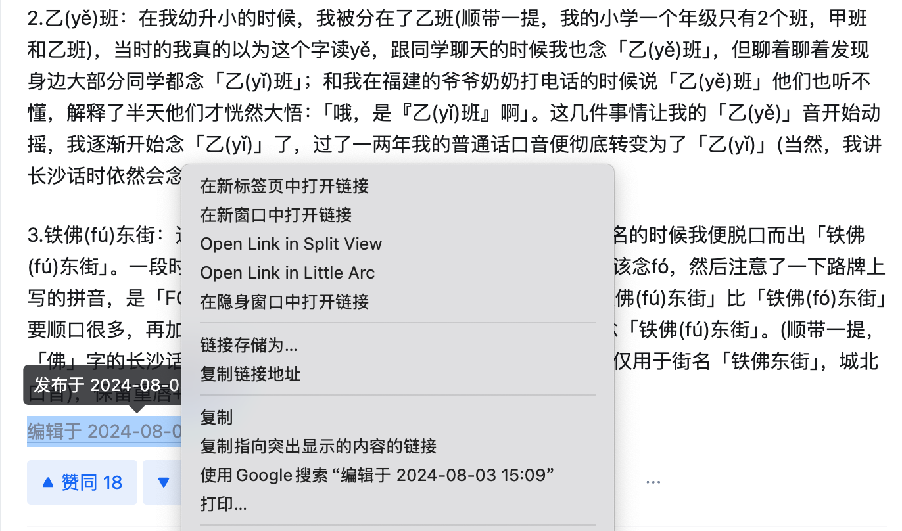
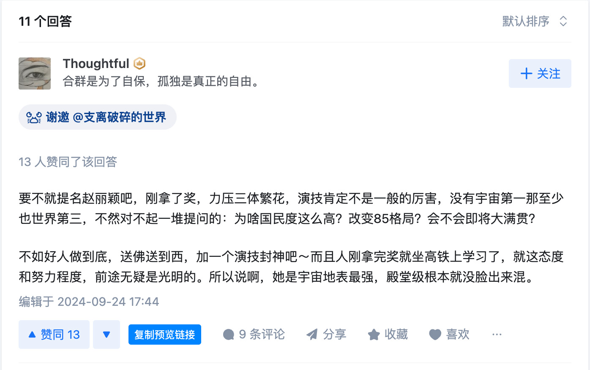

# Fix 知乎

众所周知，在 2024 年的今天，非登录用户无法阅读知乎的答案，导致一些优质内容无法在互联网上分享，许多人只能选择转载或截图。
所以，我写了这个项目，方便大家在社群里分享知乎的内容。

## 使用方法

在知乎里找到你想要分享的答案，复制答案的链接，将链接中的 `https://www.zhihu.com` 替换为 `https://www.fxzhihu.com` 即可。
例如这个答案：`https://www.zhihu.com/question/586886503/answer/2922442098`

替换后：

```
https://www.fxzhihu.com/question/586886503/answer/2922442098
```

问题：

```
https://www.fxzhihu.com/question/586886503
```

专栏文章：

```
https://zhuanlan.fxzhihu.com/p/425664231
```

在 URL 末尾添加 `?redirect=false` 可以禁止跳转到知乎原贴。

<details>
<summary>展开：复制答案链接的方法</summary>

找到答案底部的发布时间，复制链接即可。



</details>

## 支持 URL

- [x] 答案
- [x] 问题
- [x] 专栏

## 部署

Cloudflare Workers

## Telegram 机器人

[@fxzhihu_bot](https://t.me/fxzhihu_bot)

## 油猴脚本

https://greasyfork.org/zh-CN/scripts/510234-zhihu-link-fixer


